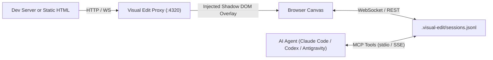

# Live Visual Edit Overlay for AI Agents (MCP)

> A local-first visual staging & draft overlay injected into web applications during development. Users can visually tweak styles, edit text inline, and reorder components in the browser. Changes are serialized into structured semantic DOM diffs and synced directly to AI coding agents via the Model Context Protocol (MCP).

---

## Key Features

* 🎨 **Live In-Browser Visual Editing**: Inline text editing (`contenteditable`), floating micro-inspector for margin/padding box models, typography, flex/grid layouts, background colors, and border styling.
* ⚡ **Intelligent Framework Source Mapping**: Resolves DOM nodes to React components, JSX files, and source line numbers using React Fiber introspection (`__REACT_DEVTOOLS_GLOBAL_HOOK__`), or AST selectors for static HTML.
* 🤖 **Modern MCP Server Integration**: Built on the official `@modelcontextprotocol/sdk` (v1.x+). Exposes tools (`visual_edit_list_sessions`, `visual_edit_get_session`, `visual_edit_claim_session`, `visual_edit_update_status`) and prompt templates (`apply_visual_edits`).
* 💅 **Tailwind CSS & Token Mapping**: Automatically maps raw pixel/color changes to standard Tailwind CSS utility classes (e.g. `p-6`, `mb-8`, `font-bold`, `bg-indigo-500`) to guide the agent toward clean, idiomatic code rather than inline styles.
* 🛡️ **Zero Style Leakage**: The client runs in an isolated Shadow DOM container and uses a streaming reverse proxy so no review code is permanently added to the target codebase.

---

## Architecture Overview



---

## Quickstart

### 1. Start Visual Review on your Web App or HTML file

For a running Vite/Next.js dev server:
```bash
npx visual-edit http://127.0.0.1:5173
```

For a static HTML page or built site:
```bash
npx visual-edit ./index.html
# or
npx visual-edit ./dist
```

Open the printed Review URL (default `http://127.0.0.1:4320`) in your browser.

### 2. Configure MCP for your AI Agent

Run the installer:
```bash
npx visual-edit install
```

Or add to your `.mcp.json` or agent config:
```json
{
  "mcpServers": {
    "visual-edit": {
      "command": "npx",
      "args": ["-y", "visual-edit", "mcp"]
    }
  }
}
```

### 3. Workflow with Coding Agents

1. **Draft in Browser**:
   * Click elements to inspect and tweak CSS properties.
   * Double-click to edit text inline.
   * Reorder or duplicate layout elements.
2. **Submit Batch**:
   * Open the bottom dock drawer, enter instructions (e.g. *"Make hero banner more punchy and expand button padding"*), and click **Send to AI Agent**.
3. **Agent Implements**:
   * The agent reads the pending session via `visual_edit_list_sessions` and `visual_edit_get_session`.
   * The agent translates the visual diffs into clean repository code (Tailwind classes, JSX props, CSS Modules).
   * The agent updates status to `implemented` via `visual_edit_update_status` and posts progress notes live to your browser.

---

## Monorepo Packages

* [`packages/core`](./packages/core): Data models, semantic DOM/style diffing algorithm, Tailwind CSS class mapper.
* [`packages/overlay`](./packages/overlay): Preact + Shadow DOM client bundle with Floating UI inspector, selection box, and review drawer.
* [`packages/server`](./packages/server): Reverse proxy, static file server, WebSocket hub, and JSONL event store.
* [`packages/mcp`](./packages/mcp): Model Context Protocol server exposing tools and prompts over stdio.
* [`packages/cli`](./packages/cli): Executable CLI runner (`visual-edit`).

---

## Development & Testing

```bash
# Install dependencies
pnpm install

# Build all packages
pnpm build

# Run unit and integration tests
pnpm test
```

## License

MIT
