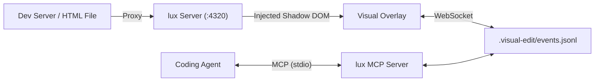

# lux-edit

Live in-browser visual editing and annotation overlay for AI coding agents.

[](https://agent-plugins.org)
[](https://modelcontextprotocol.io)
[](https://www.typescriptlang.org)
[](./LICENSE)

lux-edit injects a visual editing layer into web apps and dev servers. Reviewers can adjust layout, typography, colors, button shapes, and CSS variables directly on the running application, or drop pinned feedback comments onto elements. 

Visual changes are converted into structured diffs and Tailwind utility mappings, which coding agents can query and apply via MCP.

## Features

- **Contextual toolbar**: Detects element types (text, buttons, containers, images) and displays relevant controls.
- **Theme tokens and color palette**: Inspects CSS variables and extracted colors for live adjustments.
- **Sliders and presets**: Adjust font sizes, spacing, and border radii with origin markers and double-click reset.
- **Comment pins**: Drop feedback pins directly on elements that remain attached on scroll and resize.
- **Multi-page support**: Tracks navigation across routes and bundles edits into a single review batch.
- **MCP server integration**: Exposes tools for coding agents to wait for submissions, fetch diffs, and update task status.
- **Agent Plugins standard**: Compatible with the `agent-plugins.org` specification.

## Quickstart

### Run on a local dev server

```bash
npx lux-edit http://127.0.0.1:3000
```

### Run on static files

```bash
npx lux-edit ./index.html
# or
npx lux-edit ./dist
```

By default, the proxy server starts on `http://127.0.0.1:4320`.

## Agent Configuration

### 1. Initialize workspace files

Run in the root of your project:

```bash
npx lux-edit init
```

This creates:
- `mcp.json`
- `plugin.json`
- `skills/lux-review/SKILL.md`

### 2. Manual MCP Configuration

Add the following to your `.mcp.json` or agent configuration:

```json
{
  "mcpServers": {
    "lux": {
      "command": "npx",
      "args": ["-y", "lux-edit", "mcp"]
    }
  }
}
```

Or register with Claude Code:

```bash
claude mcp add lux -- npx -y lux-edit mcp
```

## Keyboard Shortcuts

| Shortcut | Action |
| --- | --- |
| `V` | Toggle visual edit mode |
| `C` | Toggle comment pin mode |
| `R` | Open or close review drawer |
| `Esc` | Deselect element / reset active tool / minimize overlay |
| `Cmd` + `Enter` | Submit changes to agent |

## MCP Tools

| Tool | Description |
| --- | --- |
| `lux_wait_for_review` | Waits for the user to submit review feedback in the browser and returns the diff payload. |
| `lux_list_sessions` | Lists all review sessions and draft batches. |
| `lux_get_session` | Retrieves full session data including DOM/CSS diffs and annotations. |
| `lux_update_status` | Updates session status (`draft`, `in_progress`, `implemented`, `resolved`). |
| `lux_reply_to_comment` | Adds an agent response to a comment thread. |

## Architecture



## Monorepo Packages

- `packages/core`: AST and DOM diffing logic, Tailwind mapping.
- `packages/overlay`: Preact and Shadow DOM inspector and review panel.
- `packages/server`: HTTP proxy, WebSocket hub, and local file storage.
- `packages/mcp`: MCP stdio server implementation.
- `packages/cli`: Command line executable (`lux`, `lux-edit`).

## Development

```bash
# Install dependencies
pnpm install

# Build packages
pnpm build

# Run test suite
pnpm test
```

## License

[MIT](./LICENSE) © 2026 David Satomi
