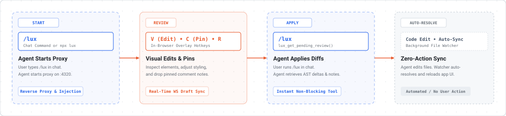
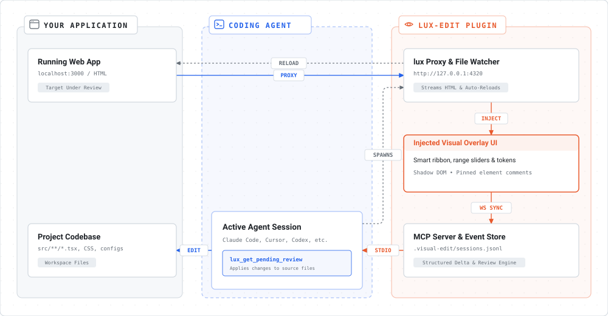

# lux-edit

In-browser visual editing, annotation, and review overlay for AI coding agents.

[](https://modelcontextprotocol.io)
[](https://agent-plugins.org/)
[](https://www.typescriptlang.org)
[](./LICENSE)
[](./PRIVACY.md)

<picture>
  <source media="(prefers-color-scheme: dark)" srcset="./docs/workflow-dark.svg">
  <source media="(prefers-color-scheme: light)" srcset="./docs/workflow-light.svg">
  
</picture>

lux-edit injects a live visual editing layer into your web app or static HTML. Adjust styling, edit text directly in the DOM, and highlight words or drop comment pins. Everything syncs in real time as structured diffs to your AI coding agent via MCP.

---

## Quickstart

### 1. Installation

Pick the method that best fits your workflow:

| Method | Command | Best For |
| --- | --- | --- |
| **Claude Code Plugin** | `claude plugin add https://github.com/David-Sat/lux-edit` | Claude Code CLI users |
| **Current Project** | `npx lux-edit init` | Zero global pollution (`.mcp.json` + skills) |
| **Global Machine** | `npm i -g lux-edit && lux init -g` | Interactive setup for Cursor, Antigravity, Claude, Windsurf |

<details>
<summary><strong>Interactive Global Installer & Advanced Options</strong></summary>

Running `lux init -g` provides an interactive checklist of detected coding tools:
```text
Select agents to configure with lux:
  1. [●] Google Antigravity    (detected)
  2. [●] Claude Code           (detected)
  3. [○] Claude Desktop        (not detected)
  4. [●] Cursor                (detected)
  5. [○] Windsurf              (not detected)

Enter numbers (e.g. 1,2), "a" for all, or press ENTER for detected defaults.
```

* **Non-interactive / CI**: `lux init -g -y` (auto-configures detected tools)
* **Target single agent**: `lux init -g --agent cursor`
* **Custom path (Zed, Aider, etc.)**: `lux init --path ~/.config/zed/settings.json`
</details>

---

### 2. How to Use (Local App Editing vs. Web Research)

#### Mode A: Local Dev & Code Editing (`/lux`)
1. **Start Review:** In your AI agent chat, type `/lux` (or in terminal: `lux http://localhost:3000` or `lux ./index.html`).
2. **Edit in Browser:** Open `http://127.0.0.1:4320`:
   * Press **`V`** to visually inspect elements, tweak CSS, or double-click text to edit directly.
   * Press **`C`** to drop comment pins or drag across text to comment on specific words.
3. **Apply Changes:** Tell your agent `/lux`. The agent reads your visual edits and comments over MCP, updates your code, and the browser auto-refreshes.

#### Mode B: Web Research, UI Teardowns & Article Discussion (`/lux-web`)
1. **Inspect Any Website:** Ask your agent `/lux-web` on a URL (or run in terminal: `lux https://overreacted.io`).
2. **Annotate & Question:** Open `http://127.0.0.1:4320`:
   * Drop pins on impressive UI components (*"How did they build this glassmorphic card?"*).
   * Highlight confusing paragraphs in articles (*"Can you explain the intuition behind this section?"*).
3. **Discuss with Agent:** Click **Submit Review** and ask your agent to review. The agent analyzes the DOM paths, computed CSS, and your notes to deconstruct the implementation or break down the text.

---

## Architecture

lux-edit bridges the gap between browser inspection and your coding agent's local filesystem context:

<picture>
  <source media="(prefers-color-scheme: dark)" srcset="./docs/architecture-dark.svg">
  <source media="(prefers-color-scheme: light)" srcset="./docs/architecture-light.svg">
  
</picture>

---

## Shortcuts

| Key | Action |
| --- | --- |
| `V` | **Visual Edit** (select elements, tweak styles, box model, double-click text) |
| `C` | **Comment Pin** (click element or highlight text selection) |
| `Enter` | Save active comment / finish text edit |
| `Shift` + `Enter` | Multi-line newline inside comment |
| `Esc` | Deselect element or close active popover / drawer |

---

## Standalone CLI Options

```bash
# Target running dev server (Next.js, Vite, Remix, etc.)
lux http://localhost:3000

# Target static HTML file
lux ./index.html

# Target live web pages for UI teardowns or article discussion
lux https://overreacted.io
lux https://news.ycombinator.com --port 4330

# Custom port or behind cloud proxies (SageMaker, Codespaces, JupyterHub)
lux http://localhost:5173 --port 4401 --base-path /codeeditor/default/ports/4401
```

<details>
<summary><strong>Manual MCP Server Configuration</strong></summary>

Add this to your `.mcp.json` or agent config:

```json
{
  "mcpServers": {
    "lux": {
      "command": "lux",
      "args": ["mcp"]
    }
  }
}
```

Or with Claude Code CLI:
```bash
claude mcp add lux -- lux mcp
```

### Available MCP Capabilities
* **Tools**:
  * `lux_get_pending_review`: Instantly retrieves active comments, text selections, and visual diffs.
  * `lux_get_session`: Retrieves details for a specific session ID.
  * `lux_list_sessions`: Lists all recorded review sessions.
* **Resources**:
  * `lux://pending-review`: Real-time markdown context of active annotations and style edits for direct agent attachment.
* **Prompts**:
  * `lux_apply_review`: One-click prompt template to apply review changes to the codebase.
</details>

---

## Update & Uninstall

### Updating

**From npm:**
```bash
# Update CLI to latest published release
npm install -g lux-edit@latest

# Refresh agent skills & MCP configs
lux init -g
```

**From local repository (monorepo / local development):**
```bash
# Rebuild the monorepo packages
pnpm build

# Refresh agent skills & MCP configs from the current local build
lux init -g
```

### Uninstalling & Cleanup

```bash
# 1. Cleanly remove MCP servers and skills from all agents (or without -g for workspace)
lux uninstall -g

# (or remove from a custom path: lux uninstall --path ~/.config/zed/settings.json)
# (or with npx: npx lux-edit uninstall -g)

# 2. Remove the CLI package
npm uninstall -g lux-edit
```

---

## License

[MIT](./LICENSE) © 2026 David Satomi. Inspired by [ui-review](https://github.com/flucas96/ui-review). • [Privacy Policy](./PRIVACY.md)
