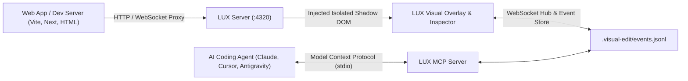

<div align="center">

# ✨ LUX
### Live User eXperience Overlay for AI Coding Agents

[](https://agent-plugins.org)
[](https://modelcontextprotocol.io)
[](https://www.typescriptlang.org)
[](./LICENSE)

**LUX** is an in-browser visual editing and annotation layer for AI coding agents. Tweak layouts, test typography scales, change button shapes, edit text inline, and adjust global design tokens directly on your running web app. 

LUX converts your visual draft into structured AST diffs, Tailwind utility suggestions, and HTML snippets, synced in real time to **Claude Code**, **Antigravity**, **Cursor**, **Codex**, **Windsurf**, and **Gemini CLI**.

</div>

---

## 🌟 Highlights

* 🎯 **Smart Start Ribbon**: Automatically detects element types (Text, Buttons, Containers, Images, Lists) and surfaces tailored controls.
* 🎨 **Live App Color Palette & Theme Tokens**: Live-scans your app for on-brand color swatches. Edit global CSS variables (`--primary`, `--accent`, `--bg`, `--radius`) with 1-click real-time preview and instant revert.
* 🎚️ **Interactive Sliders with Origin Indicators**: Smooth range sliders for Font Size, Gap, and Radius with visual origin tick marks and double-click reset.
* 💬 **Element Comment Pins**: Drop numbered feedback pins directly onto rendered elements. Pins stay locked during scroll, resize, and responsive testing.
* ⌨️ **Keyboard Shortcuts & Stepped Navigation**: Press `V` for Visual Edit, `C` for Comment, `R` for Review Drawer. Stepped `Esc` deselects active tools first before minimizing.
* 🌐 **Multi-Page Aggregate Tracking**: Tracks page routes (`pathname`, `url`, `pageTitle`) so multi-page SPA edits are bundled into a single organized review batch.
* ⚡ **Install-Free Agent Plugins Standard (1.0.0)**: Package skills, tools, and MCP servers into a single portable unit compatible across all modern agentic IDEs.
* 🔄 **Zero-Latency Live File Reload**: Automatically notifies the browser when the coding agent modifies the codebase.
* 🛡️ **Zero Style Leakage**: Fully isolated Shadow DOM Web Component (`<visual-edit-overlay>`). No CSS conflicts with your application.

---

## 🚀 Quickstart

### 1. Instant Launch (Zero Installation Required)

For an active **Vite / Next.js / React / Vue** development server:
```bash
npx lux-edit http://127.0.0.1:3000
```

For a **static HTML file or build directory**:
```bash
npx lux-edit ./index.html
# or
npx lux-edit ./dist
```

Open the printed Review URL (default `http://127.0.0.1:4320`) in your browser.

---

### 2. Connect Your AI Coding Agent

#### Option A: One-Command Setup (`npx lux-edit init`)
Run in your project root:
```bash
npx lux-edit init
```
This automatically writes:
* `mcp.json` (Standard MCP definition)
* `plugin.json` (Agent Plugins 1.0.0 manifest)
* `skills/lux-review/SKILL.md` (Portable agent instructions)
* Auto-syncs to `~/.claude/skills` if Claude Code is detected!

#### Option B: Configure MCP Manually
Add LUX to your project's `.mcp.json` or agent config:
```json
{
  "mcpServers": {
    "lux": {
      "command": "npx",
      "args": ["-y", "lux-edit", "mcp"]
    }
  }
}
```

Or register via CLI:
```bash
claude mcp add lux -- npx -y lux-edit mcp
```

---

## 🎮 Keyboard Shortcuts

| Key | Action |
|---|---|
| <kbd>V</kbd> | Toggle **Visual Edit Mode** (inspect & tweak styles) |
| <kbd>C</kbd> | Toggle **Comment Pin Mode** (drop feedback pins) |
| <kbd>R</kbd> | Open / Close **Review Changes Drawer** |
| <kbd>Esc</kbd> | Stepped navigation: Deselect element ➔ Reset tool ➔ Minimize dock |
| <kbd>Cmd</kbd> + <kbd>Enter</kbd> | Send draft batch to AI Agent |

---

## 🛠️ MCP Tools Reference

| Tool Name | Description |
|---|---|
| `lux_wait_for_review` | Blocking wakeup tool. Waits for the user to click "Send to Agent" and returns structured diffs. |
| `lux_list_sessions` | Lists all visual edit draft batches and comment sessions. |
| `lux_get_session` | Retrieves full session payload, AST deltas, component paths, and annotations. |
| `lux_update_status` | Updates session status (`draft` ➔ `in_progress` ➔ `implemented` ➔ `resolved`). |
| `lux_reply_to_comment`| Posts an agent reply directly into a comment thread. |

---

## 🏗️ Architecture



---

## 📦 Monorepo Structure

* [`packages/core`](./packages/core): Data models, AST/DOM diffing algorithms, Tailwind CSS token mapper.
* [`packages/overlay`](./packages/overlay): Preact + Shadow DOM client with Floating UI inspector, color palettes, and review panel.
* [`packages/server`](./packages/server): Reverse proxy, static file server, live file watcher, WebSocket hub, and JSONL store.
* [`packages/mcp`](./packages/mcp): Model Context Protocol server exposing tools and prompts over stdio.
* [`packages/cli`](./packages/cli): Executable CLI runner (`lux`, `lux-edit`).

---

## 💻 Development & Contributing

```bash
# Clone the repository
git clone https://github.com/David-Sat/lux-edit.git
cd lux-edit

# Install monorepo dependencies
pnpm install

# Build all workspace packages
pnpm build

# Run unit and integration tests
pnpm test
```

---

## 📄 License

MIT © 2026 David Satomi
