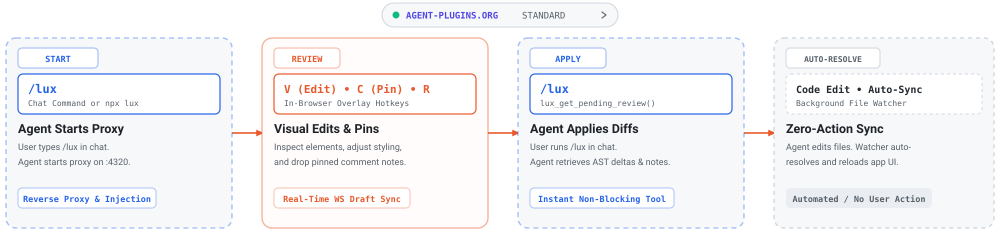

# lux-edit

In-browser visual editing, annotation, and review overlay for AI coding agents.

[](https://modelcontextprotocol.io)
[](https://www.typescriptlang.org)
[](./LICENSE)



lux-edit injects a visual editing layer into running web applications and static HTML files. You can adjust styles, edit text, and drop comment pins directly on DOM elements. Edits and notes are converted into structured diffs that coding agents inspect and apply via MCP.

This project was inspired by [ui-review](https://github.com/flucas96/ui-review) by Fabian Lucas.

## Quickstart

### 1. Initialize configuration

Run in your project root for local workspace setup, or pass `-g` to configure all agents machine-wide:

```bash
# Local workspace setup (creates mcp.json, plugin.json, skills/)
npx lux-edit init

# Global setup (configures Claude Code, Claude Desktop, Cursor, Windsurf)
npx lux-edit init -g
```

### 2. Start review session

In your AI agent chat (Claude Code, Cursor, Codex, etc.), tell your agent:

```text
/lux
```

The agent launches the lux proxy on `http://127.0.0.1:4320`.

### 3. Add visual edits & comments

1. Open `http://127.0.0.1:4320` in your browser.
2. Press **`V`** to visually inspect/tweak styling or **`C`** to pin comments onto elements.
3. Edits and pins are saved automatically in real time.

### 4. Review & apply

Back in your agent chat, run:

```text
/lux
```

The agent calls `lux_get_pending_review()` to instantly retrieve all comments and visual diffs, then updates your source files. When the agent saves the files, lux's file watcher auto-resolves your feedback and refreshes the browser.

---

## Manual CLI Usage

You can also run lux standalone without an agent:

```bash
# Target a running dev server (e.g. Next.js, Vite, Remix)
npx lux http://localhost:3000

# Target static HTML files
npx lux ./index.html

# Behind path-prefixing reverse proxies (AWS SageMaker Studio, GitHub Codespaces, JupyterHub)
npx lux http://localhost:5173 --port 4401 --base-path /codeeditor/default/ports/4401
# (or set LUX_BASE_PATH=/codeeditor/default/ports/4401)
```

## In-Browser Controls

| Shortcut | Action |
| --- | --- |
| `V` | Visual edit mode (inspect elements, tweak typography, spacing, colors) |
| `C` | Comment pin mode (click anywhere to drop a feedback pin) |
| `R` | Toggle review drawer to inspect pending diffs and history |
| `Enter` | Save comment |
| `Shift` + `Enter` | Multi-line newline inside comment |
| `Esc` | Deselect element or close active popover |

## MCP Server Configuration

If configuring MCP manually, add this to your `.mcp.json` or agent settings:

```json
{
  "mcpServers": {
    "lux": {
      "command": "npx",
      "args": ["-y", "lux-edit", "mcp"]
    }
  }
}
```

Or with Claude Code CLI:

```bash
claude mcp add lux -- npx -y lux-edit mcp
```

## MCP Tools

- `lux_get_pending_review`: Instantly retrieves all active comment pins, selectors, and visual diffs without blocking.
- `lux_get_session`: Retrieves details for a specific session ID.
- `lux_list_sessions`: Lists all recorded review sessions.

## Development

```bash
# Install workspace dependencies
pnpm install

# Build all packages
pnpm build

# Run unit tests
pnpm test
```

## License

[MIT](./LICENSE) © 2026 David Satomi
